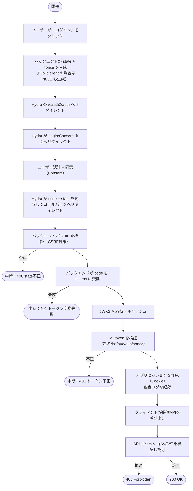
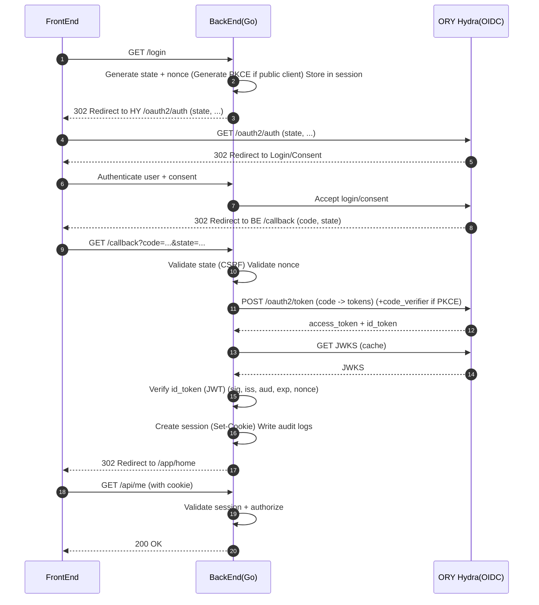

# ORYとは何か／使い方の全体像／シーケンス図（案件向けイメージ資料）

## 0. 前提、概念

### 0.1 前提

認証、認可をORY（認証・認可OSS群）で実装する案件に参画するにあたり、

- ORYの全体像（コンポーネントと役割）
- Goアプリとの連携イメージ（責務分担）
- 最小E2Eのアーキテクチャ図・シーケンス図
- 失敗パターンとログのイメージ
  をまとめた資料です。

### 0.2 認証・認可の概念

- **認証（Authentication）**：ユーザーが「誰であるか」を確認するプロセス。例：ログイン、パスワード認証、パスキー認証など
- **認可（Authorization）**：認証されたユーザーが「何ができるか」を決定するプロセス。例：OAuth2のスコープ、RBAC（役割ベースアクセス制御）、ABAC（属性ベースアクセス制御）など
- **OAuth2 / OpenID Connect（OIDC）**：認可フレームワーク（OAuth2）と認証プロトコル（OIDC）。ORY Hydraはこれを実装している。
- **JWT（JSON Web Token）**：認証情報やクレームを安全に伝えるためのトークン形式。署名されているため改ざん検知が可能。
- **CSRF（Cross-Site Request Forgery）**：ユーザーが意図しないリクエストを攻撃者が送信させる攻撃。stateパラメータで対策するのが一般的。
- **PKCE（Proof Key for Code Exchange）**：OAuth2の拡張機能で、クライアントがコード交換の際に追加の検証を行うことでセキュリティを強化する仕組み。特にSPAやモバイルアプリで推奨される。
- **リフレッシュトークン**：OAuth2で、アクセストークンの有効期限が切れた際に新しいアクセストークンを取得するためのトークン。セキュリティ上の理由から、クライアント側で安全に保管する必要がある。
- **認可コード**：OAuth2のフローで、認可サーバーがクライアントに一時的に発行するコード。クライアントはこのコードを使ってアクセストークンを取得する。
- **アクセストークン**：OAuth2で、クライアントがリソースサーバーにアクセスするために使用するトークン。通常は短期間有効で、リソースへのアクセス権を表す。
- **IDトークン**：OIDCで、ユーザーの認証情報を含むJWT。クライアントがユーザーのアイデンティティを確認するために使用する。
- **JWKS（JSON Web Key Set）**：JWTの署名検証に使用される公開鍵のセット。認可サーバーが提供するエンドポイントから取得する。
- **RBAC（Role-Based Access Control）**：ユーザーの役割に基づいてアクセス権を管理する方法。例：管理者は全てのリソースにアクセス可能、一般ユーザーは自分のリソースのみアクセス可能など。
- **ABAC（Attribute-Based Access Control）**：ユーザーやリソースの属性に基づいてアクセス権を管理する方法。例：ユーザーの部署やリソースの機密レベルなどの属性を考慮してアクセスを制御する。
- **claims** : iss/aud/expなどの検証
    - claimsとは、JWTのペイロード部分に含まれる情報（例：発行者、対象ユーザー、有効期限など）。これらを検証することで、トークンが正当なものであるかを確認する。
    - iss（issuer）: トークンを発行した認可サーバーの識別子。HydraのURLが入ることが多い。
    - aud（audience）: トークンの対象。通常はクライアントIDが入る。
    - exp（expiration time）: トークンの有効期限。これを過ぎるとトークンは無効になる。

---

## 1. ORYとは

ORYは「認証・認可」を部品化して提供するOSS群です。用途に応じてコンポーネントを組み合わせます。

- **ORY Hydra**：OAuth2 / OpenID Connect（OIDC）の認可・トークン発行
    - 認可エンドポイント、tokenエンドポイント、JWKSエンドポイントなどを提供
- **ORY Kratos**：ユーザー管理（ログイン/登録、パスワード/パスキー等の認証手段）
    - 認証フローのUIも提供（ただしHydraの認可フローと組み合わせる場合は、独自UIを用意してHydraのAPIを呼び出す形が多い）
- **ORY Oathkeeper**：前段ゲート（APIへのリクエストを認証・認可してから通す）
    - 認証方法の定義（JWT、Cookie、APIキーなど）とルールベースのアクセス制御を提供
- **ORY Keto**：認可（RBAC/関係性ベースなど）
    - アクセスポリシーの管理と評価を提供（例：ユーザーAはリソースBに対してreadアクセスがあるか？）

---

## 2. “使い方”のイメージ

### 2.1 役割のざっくり整理（Hydra中心）

- **Hydraがやること**：認可（ログイン承認）・トークン発行・公開鍵（JWKS）の提供
    - 認可エンドポイントでログイン承認を行い、認可コードを発行
    - tokenエンドポイントで認可コードをアクセストークン（とIDトークン）に交換
    - JWKSエンドポイントで公開鍵を提供（Goアプリはこれを使ってJWT検証）
        - これらはHydraが提供するAPIで完結させるのが基本。  
      ログインUIはHydraのホストするものを使うか、独自UIを用意してHydraのAPIを呼び出す形になる。
    - 認可リクエストのリダイレクト（ユーザーをログイン画面に誘導し、認可後にcodeを返す）
- **Goアプリがやること**：
    - ログイン開始の導線
    - コールバック受信と **state検証（CSRF対策）**
    - token交換(認可コード → アクセストークン/IDトークン)
    - **IDトークン/JWT検証**（署名・claims）
        - 署名 : JWKSエンドポイントから公開鍵を取得して検証
    - セッション確立（Cookie/JWT等）と保護APIの認可
        - セッション管理は現場の方針に従う。Cookieセッションもあれば、JWTを発行してクライアントで保持するパターンもある。
    - 監査・調査ログ（成功/失敗、相関ID、理由分類）
    - 失敗パターンのハンドリング（state不一致、token交換失敗、JWT検証失敗など）
        - state不一致：CSRFの可能性があるため、401エラーでリトライ導線を提供。監査ログには理由コード（例：STATE_MISMATCH）を残す。
        - token交換失敗：codeの期限切れ、client設定の不整合、redirect_uriの不一致などが考えられる。エラー分類（例：TOKEN_EXCHANGE_FAILED）を行い、再試行の可否や外部I/Fの結果要点をログに残す。
      - JWT検証失敗：署名不一致、iss/aud不一致、期限切れ、鍵ローテーションの追従漏れなどが考えられる。JWKSのキャッシュ戦略を検討し、検証失敗の理由（例：JWT_INVALID / JWT_EXPIRED）をログに残す。

---

## 3. 簡単なフローチャート（Hydra × Go のE2Eイメージ）

---

## 4. シーケンス図（最重要：Hydra × Go のE2E）

> “認証が成立した”と言える最小ライン：  
> **ログイン開始 → code受領 → token交換 → IDトークン検証 → セッション確立 → 保護APIが通る**

---

## 5. 失敗時

### 5.1 代表的な失敗パターン

- **state不一致**：CSRF疑い・セッション切れ
    - 対応：401/リトライ導線、監査ログに理由コード（STATE_MISMATCH）を残す
- **token交換失敗**：code期限切れ、client設定不整合、redirect_uri不一致 等
    - 対応：エラー分類（TOKEN_EXCHANGE_FAILED）、再試行可否、外部I/F結果要点をログ
- **JWT検証失敗**：署名不一致、iss/aud不一致、期限切れ、鍵ローテ追従漏れ
    - 対応：JWKSキャッシュ戦略、検証失敗理由（JWT_INVALID / JWT_EXPIRED）をログ

### 5.2 ログ（監査/調査）の最低ライン例

- request_id（相関ID）
- user_identifier（分かる範囲で）
- outcome（success/failure）
- reason_code（STATE_MISMATCH / TOKEN_EXCHANGE_FAILED / JWT_INVALID など）
- external_call_summary（HTTP status/endpoint/latency の要点。機密は出さない）

---

## 6. 実装チェックリスト

- [ ] state生成・検証（CSRF対策）
- [ ] 認可URL生成（必要に応じてPKCE）
- [ ] callback受信（エラー分岐含む）
- [ ] token交換（失敗時ログ）
- [ ] JWKS取得・キャッシュ
- [ ] IDトークン/JWT検証（iss/aud/exp）
- [ ] セッション確立（Cookie/JWT等：現場方針に従う）
- [ ] 保護API（認証ミドルウェア）
- [ ] 監査/調査ログ（成功/失敗、理由分類）
- [ ] secret管理（env/secret store、リポジトリ非保持）

---
